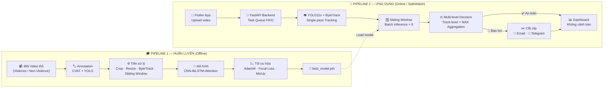
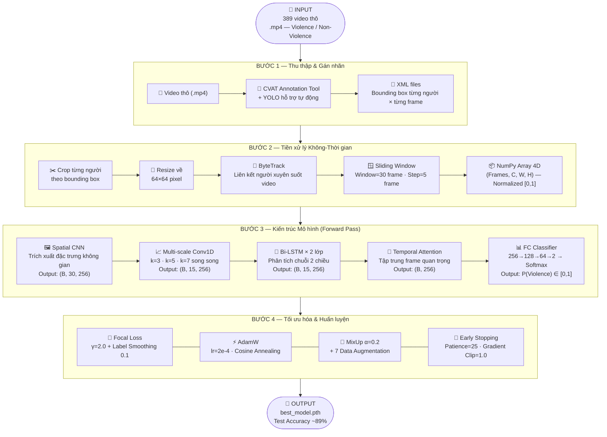
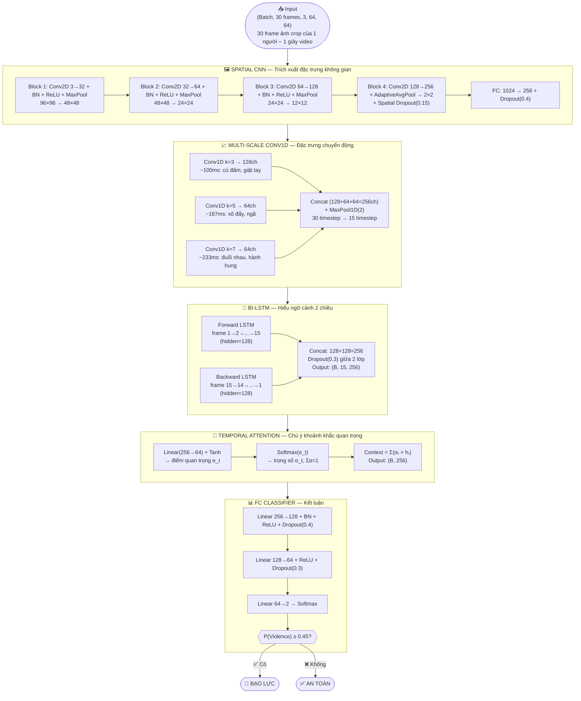
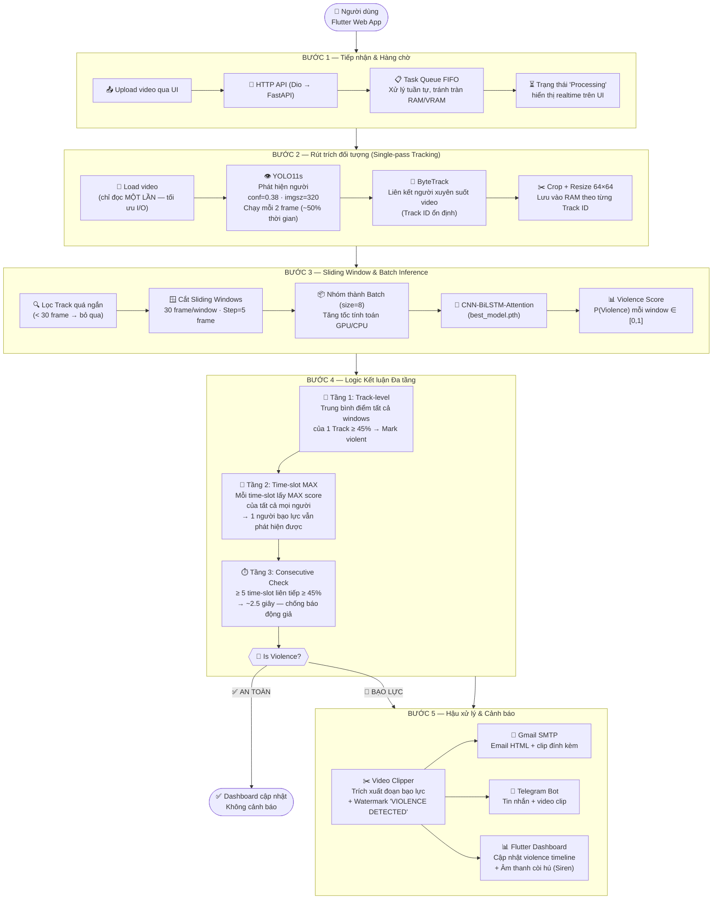
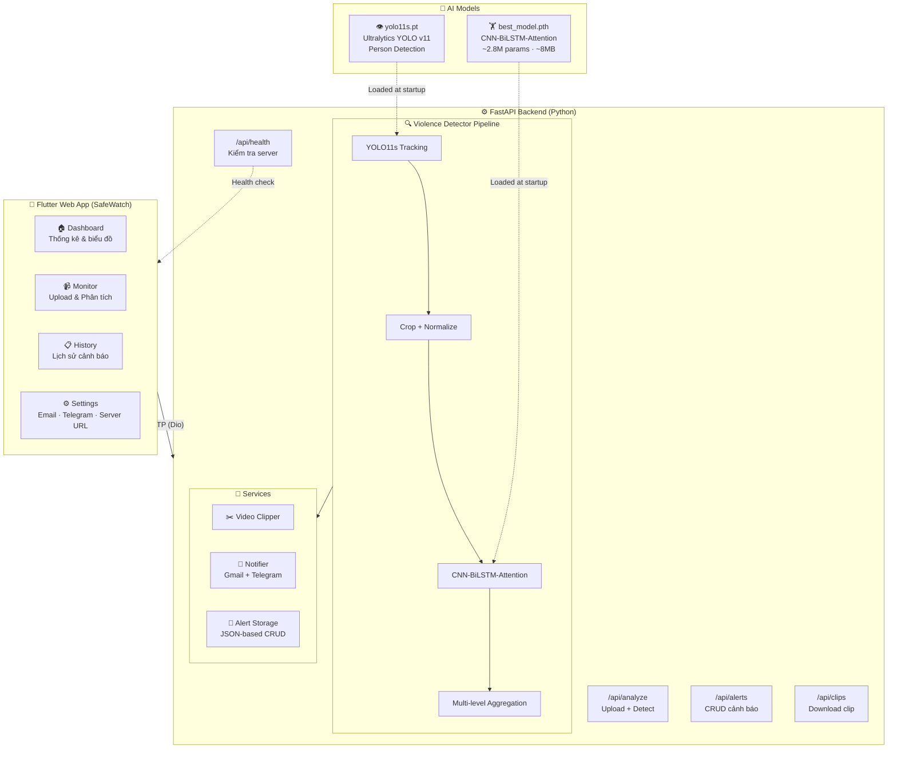

# 🛡️ Detect Violence in School — SafeWatch

> **Đồ án tốt nghiệp HUTECH 2026** — Hệ thống phát hiện hành vi bạo lực trong môi trường học đường sử dụng Deep Learning, với ứng dụng Flutter và backend FastAPI.

📄 **[Báo cáo đồ án đầy đủ (PDF)](./report_DATN.pdf)**

---

## 📋 Mục lục

- [Tổng quan](#-tổng-quan)
- [Pipeline tổng thể](#-pipeline-tổng-thể)
- [Pipeline Huấn luyện](#-pipeline-1-huấn-luyện-mô-hình)
- [Kiến trúc mô hình AI](#-kiến-trúc-mô-hình-ai--cnn-bilstm-attention)
- [Pipeline Ứng dụng](#-pipeline-2-ứng-dụng-thực-tế--safewatch-inference)
- [Kiến trúc hệ thống](#-kiến-trúc-hệ-thống)
- [Dataset](#-dataset)
- [Backend API](#-backend-api)
- [Ứng dụng Flutter — SafeWatch](#-ứng-dụng-flutter--safewatch)
- [Kết quả thực nghiệm](#-kết-quả-thực-nghiệm)
- [Cài đặt và chạy](#-cài-đặt-và-chạy)
- [Cấu trúc thư mục](#-cấu-trúc-thư-mục)
- [Công nghệ sử dụng](#-công-nghệ-sử-dụng)

---

## 🎯 Tổng quan

**SafeWatch** là hệ thống phát hiện bạo lực trong trường học theo thời gian thực, bao gồm 3 thành phần chính:

| Thành phần | Mô tả |
|---|---|
| **AI Model** | Mô hình CNN-BiLSTM-Attention (~2.8M params) huấn luyện trên dữ liệu video bạo lực/không bạo lực |
| **Backend** | FastAPI server xử lý video upload, chạy detection, cắt clip, gửi cảnh báo |
| **Flutter App** | Ứng dụng web SafeWatch — upload video, xem kết quả, quản lý cảnh báo |

---

## 🗺️ Pipeline Tổng Thể

Hệ thống được chia làm **hai luồng hoàn toàn tách biệt**:



---

## 🎓 Pipeline 1: Huấn luyện Mô hình



---

## 🧠 Kiến trúc Mô hình AI — CNN-BiLSTM-Attention



### Thông số mô hình

| Thành phần | Chi tiết |
|---|---|
| **Tổng tham số** | ~2,800,000 (~2.8M) — 100% trainable |
| **Kích thước file** | ~8 MB (float32) |
| **Input** | (Batch, 30, 3, 64, 64) |
| **Output** | P(Violence) ∈ [0, 1] |
| **Ngưỡng quyết định** | ≥ 45% → Bạo lực |

### Kỹ thuật huấn luyện

| Kỹ thuật | Chi tiết |
|---|---|
| **Loss** | Focal Loss (γ=2.0) + Class Weights + Label Smoothing (0.1) |
| **Optimizer** | AdamW (lr=2e-4, weight_decay=3e-4) |
| **LR Schedule** | 5-epoch Warmup → Cosine Annealing Warm Restarts |
| **MixUp** | α=0.2 — trộn 2 mẫu ngẫu nhiên, giảm overfitting |
| **Augmentation** | Flip ngang · Temporal Reverse · Speed Variation · Brightness Jitter · Gaussian Noise · Random Erasing (7 kỹ thuật) |
| **Early Stopping** | Patience = 25 epoch |
| **Gradient Clipping** | max_norm = 1.0 |

---

## 🚀 Pipeline 2: Ứng dụng thực tế — SafeWatch Inference



### Logic phát hiện — Tại sao dùng MAX thay vì MEAN?

> **Ví dụ thực tế**: 2 người đánh nhau (P=0.85) + 15 người đứng xem (P=0.08)
> - **MEAN** = 0.17 → ❌ **Bỏ sót bạo lực!**
> - **MAX** = 0.85 → ✅ **Phát hiện đúng!**

Trong môi trường học đường, chỉ cần **1–2 người** có hành vi bạo lực giữa đám đông là đủ để cảnh báo. Nếu dùng MEAN, xác suất bạo lực sẽ bị "làm loãng" bởi đám đông người xem.

---

## 🏗️ Kiến trúc Hệ thống



---

## ⚡ Backend API

Backend xây dựng bằng **FastAPI**, cung cấp các endpoint:

| Method | Endpoint | Mô tả |
|---|---|---|
| `GET` | `/api/health` | Kiểm tra trạng thái server |
| `POST` | `/api/analyze` | Upload video + phân tích bạo lực |
| `GET` | `/api/alerts` | Lấy danh sách cảnh báo |
| `GET` | `/api/alerts/{id}` | Xem chi tiết 1 cảnh báo |
| `DELETE` | `/api/alerts/{id}` | Xoá cảnh báo |
| `GET` | `/api/clips/{job_id}/{filename}` | Download clip bạo lực |

### Tính năng

- **Phân tích video**: Upload → YOLO tracking → CNN-BiLSTM → trả kết quả JSON
- **Cắt clip tự động**: Cắt chính xác đoạn bạo lực với watermark "VIOLENCE DETECTED"
- **Thông báo đa kênh**:
  - 📧 **Gmail**: Email HTML đẹp kèm clip đính kèm (SMTP + App Password)
  - 📱 **Telegram Bot**: Gửi tin nhắn + video clip qua Bot API
- **Lưu trữ cảnh báo**: JSON-based storage, hỗ trợ CRUD

---

## 📱 Ứng dụng Flutter — SafeWatch

Ứng dụng Flutter Web với giao diện dark mode hiện đại.

### Các màn hình

| Màn hình | Mô tả |
|---|---|
| **Onboarding** | Giới thiệu ứng dụng lần đầu sử dụng |
| **Home** | Navigation bar với 4 tab chính |
| **Monitor** | Upload video + xem kết quả phân tích real-time |
| **Dashboard** | Thống kê tổng quan: biểu đồ tròn, bar chart, timeline |
| **History** | Lịch sử cảnh báo, tìm kiếm, chi tiết từng alert |
| **Queue** | Hàng đợi xử lý khi upload nhiều video |
| **Settings** | Cấu hình email, Telegram, server URL |

### Tính năng nổi bật

- 🎨 **Giao diện Dark Mode** premium với animations (flutter_animate)
- 📊 **Dashboard thống kê** với biểu đồ tương tác (fl_chart)
- 📄 **Xuất báo cáo PDF** chi tiết kết quả phân tích
- 🔔 **Âm thanh cảnh báo** tuỳ chỉnh được
- 📹 **Violence Timeline** — hiển thị timeline đoạn bạo lực trực quan
- ⚙️ **Cấu hình linh hoạt** — thay đổi server URL, email, Telegram ngay trong app

### Thư viện Flutter sử dụng

| Package | Mục đích |
|---|---|
| `dio` | HTTP client cho API calls |
| `file_picker` | Chọn file video để upload |
| `fl_chart` | Biểu đồ thống kê |
| `flutter_animate` | Micro-animations cho UI |
| `google_fonts` | Typography đẹp |
| `shared_preferences` | Lưu cài đặt local |
| `pdf` + `printing` | Xuất báo cáo PDF |
| `intl` | Format ngày giờ |
| `percent_indicator` | Thanh tiến trình |

---

## 📦 Dataset

### Tải xuống

> 📥 **Download dataset tại [GitHub Releases](https://github.com/MinhkhoaDS22/dectect_violence_in_school/releases)**

Dataset bao gồm file `data_labels.zip` chứa toàn bộ video gốc và annotation labels.

### Thông tin dataset

| Thông tin | Chi tiết |
|---|---|
| **Tổng số video** | 300 video |
| **Phân loại** | Violence (bạo lực) + Non-Violence (không bạo lực) |
| **Nguồn** | Thu thập từ môi trường trường học |
| **Annotation** | Bounding box theo frame cho từng người (CVAT format — XML) |
| **FPS gốc** | Đa dạng, được chuẩn hoá về 30 FPS khi tiền xử lý |

### Cấu trúc bên trong `data_labels.zip`

```
data_labels.zip
├── data/
│   ├── violence/              # Video có hành vi bạo lực
│   │   ├── v_001.mp4
│   │   └── ...
│   └── non_violence/          # Video không có bạo lực
│       ├── nv_001.mp4
│       └── ...
└── fix_labels/                # Annotation XML (CVAT format)
    ├── violence/
    │   ├── v_001.xml
    │   └── ...
    └── non_violence/
        ├── nv_001.xml
        └── ...
```

### Chia dữ liệu

Dữ liệu được chia theo **video** (không theo track) để tránh data leakage:

| Tập | Tỷ lệ | Mục đích |
|---|---|---|
| **Train** | 70% | Huấn luyện mô hình |
| **Validation** | 20% | Điều chỉnh hyperparameter, early stopping |
| **Test** | 10% | Đánh giá hiệu suất cuối cùng |

> ⚠️ **Lưu ý**: 300 video → ~500-800 tracks → ~2000+ sliding windows (mỗi window = 30 frame = 1 giây).

---

## 📊 Kết quả thực nghiệm

### Hiệu suất mô hình

| Metric | Giá trị |
|---|---|
| **Train Accuracy** | ~90% |
| **Test Accuracy** | ~89% |
| **Tổng tham số** | ~2.8M |
| **Kích thước model** | ~8 MB |
| **Ngưỡng phân loại** | 45% |
| **Consecutive Windows** | ≥ 5 (~2.5 giây liên tiếp) |

> **Lưu ý**: Confusion matrix đánh giá ở cấp **sliding window** (mỗi window = 1 giây video), không phải cấp video. 300 video → ~500-800 tracks → ~2000+ windows.

---

## 🚀 Cài đặt và chạy

### Yêu cầu

- Python 3.10+
- Flutter 3.10+ (SDK ^3.10.1)
- CUDA (khuyến nghị, để chạy GPU)

### 1. Huấn luyện mô hình

```bash
# Cài đặt dependencies
pip install torch torchvision opencv-python numpy matplotlib seaborn scikit-learn tqdm ultralytics

# Chuẩn bị dữ liệu
# - Đặt video vào data/violence/ và data/non_violence/
# - Đặt XML annotation (CVAT) vào fix_labels/violence/ và fix_labels/non_violence/

# Chạy huấn luyện
python train_ai.py
# → Output: best_model.pth, confusion matrix, biểu đồ
```

### 2. Chạy Backend

```bash
cd backend

# Cài đặt dependencies
pip install -r requirements.txt
pip install torch torchvision ultralytics

# Cấu hình
cp .env.example .env
# → Sửa file .env: điền Gmail App Password, Telegram Bot Token, đường dẫn model

# Chạy server
uvicorn main:app --reload --host 0.0.0.0 --port 8000
# hoặc
python main.py
```

**Cấu hình `.env`**:

```env
# Gmail (bật 2FA → tạo App Password)
GMAIL_SENDER=your_email@gmail.com
GMAIL_APP_PASSWORD=xxxx xxxx xxxx xxxx

# Telegram Bot (tạo bằng @BotFather)
TELEGRAM_BOT_TOKEN=your_bot_token_here

# Đường dẫn model
MODEL_PATH=../results/best_model.pth
YOLO_PATH=../yolo11s.pt
```

### 3. Chạy Flutter App

```bash
cd violence_app

# Cài đặt dependencies
flutter pub get

# Chạy ứng dụng web
flutter run -d chrome

# Hoặc build web
flutter build web
```

> Sau khi chạy app, vào **Settings** để cấu hình Server URL trỏ về backend (mặc định `http://localhost:8000`).

---

## 📁 Cấu trúc thư mục

```
DATN/
├── train_ai.py              # Script huấn luyện model CNN-BiLSTM-Attention
├── evaluate_model.py        # Script đánh giá hiệu suất mô hình
├── dectect_people.py        # Script detect người (testing)
├── rename.py                # Đổi tên file tiện ích
├── report_DATN.pdf          # Báo cáo đồ án tốt nghiệp
│
├── data/                    # Dữ liệu video gốc
│   ├── violence/            #   Video bạo lực
│   └── non_violence/        #   Video không bạo lực
│
├── fix_labels/              # Annotation XML (CVAT format)
│   ├── violence/
│   └── non_violence/
│
├── processed_tracks_v5/     # Cache dữ liệu đã tiền xử lý (.npy)
│
├── results/                 # Kết quả huấn luyện
│   ├── best_model.pth       #   Model tốt nhất
│   ├── improved_history.png #   Biểu đồ Loss & Accuracy
│   ├── confusion_matrix_*.png
│   └── data_distribution.png
│
├── backend/                 # FastAPI Backend
│   ├── main.py              #   API endpoints
│   ├── violence_detector.py #   Detection pipeline
│   ├── video_clipper.py     #   Cắt clip bạo lực
│   ├── notifier.py          #   Gửi Gmail + Telegram
│   ├── requirements.txt     #   Python dependencies
│   ├── .env.example         #   Mẫu cấu hình
│   ├── uploads/             #   Video upload tạm
│   └── clips/               #   Clip bạo lực đã cắt
│
├── violence_app/            # Flutter App (SafeWatch)
│   ├── lib/
│   │   ├── main.dart        #   Entry point
│   │   ├── models/          #   Data models (AlertModel, QueueJob)
│   │   ├── screens/         #   7 màn hình UI
│   │   ├── services/        #   API, PDF, Queue, Sound services
│   │   ├── theme/           #   Dark theme configuration
│   │   └── widgets/         #   Custom widgets (Timeline, SoundBar)
│   ├── pubspec.yaml         #   Flutter dependencies
│   └── web/                 #   Web platform files
│
├── yolo11s.pt               # YOLOv11s pre-trained weights
└── pipeline.txt             # Mô tả chi tiết pipeline (text)
```

---

## 🛠️ Công nghệ sử dụng

### AI / Deep Learning

| Công nghệ | Phiên bản | Mục đích |
|---|---|---|
| PyTorch | - | Framework deep learning chính |
| Ultralytics YOLO | v11s | Phát hiện và tracking người (ByteTrack) |
| OpenCV | 4.9.0 | Xử lý video, crop, resize |
| scikit-learn | - | Metrics, confusion matrix |
| NumPy | 1.26.4 | Xử lý dữ liệu số |

### Backend

| Công nghệ | Phiên bản | Mục đích |
|---|---|---|
| FastAPI | 0.111.0 | REST API framework |
| Uvicorn | 0.30.0 | ASGI server |
| python-dotenv | 1.0.1 | Quản lý biến môi trường |
| smtplib | built-in | Gửi email Gmail |
| python-telegram-bot | 21.3 | Gửi cảnh báo Telegram |

### Frontend

| Công nghệ | Phiên bản | Mục đích |
|---|---|---|
| Flutter | SDK ^3.10.1 | Framework UI cross-platform |
| Dart | - | Ngôn ngữ lập trình |
| Dio | 5.4.3 | HTTP client |
| fl_chart | 1.2.0 | Biểu đồ thống kê |
| flutter_animate | 4.5.0 | Animations |

### Annotation

| Công cụ | Mục đích |
|---|---|
| CVAT | Gán nhãn bounding box theo frame cho từng người trong video |

---

## 👨‍💻 Tác giả

Đồ án tốt nghiệp — Trường Đại học Công nghệ TP.HCM (HUTECH) 2026

---

*SafeWatch — Phát hiện bạo lực, bảo vệ học đường* 🛡️
