# 🛡️ Detect Violence in School — SafeWatch

> **Đồ án tốt nghiệp HUTECH 2026** — Hệ thống **End-to-End** phát hiện hành vi bạo lực trong môi trường học đường sử dụng Deep Learning, tích hợp hoàn chỉnh từ Camera → AI → Cảnh báo tức thì.

📄 **[Báo cáo đồ án đầy đủ (PDF)](./report_DATN.pdf)**

---

## 📋 Mục lục

- [Tổng quan](#-tổng-quan)
- [Demo End-to-End](#-demo-end-to-end)
- [Pipeline tổng thể](#-pipeline-tổng-thể)
- [Pipeline 1 — Huấn luyện](#-pipeline-1-huấn-luyện-mô-hình)
- [Kiến trúc mô hình AI](#-kiến-trúc-mô-hình-ai--cnn-bilstm-attention)
- [Pipeline 2 — Ứng dụng SafeWatch](#-pipeline-2-ứng-dụng-thực-tế--safewatch-inference)
- [Kiến trúc hệ thống](#-kiến-trúc-hệ-thống)
- [Giao diện ứng dụng](#-giao-diện-ứng-dụng--safewatch)
- [Kết quả thực nghiệm](#-kết-quả-thực-nghiệm)
- [Dataset](#-dataset)
- [Backend API](#-backend-api)
- [Cài đặt và chạy](#-cài-đặt-và-chạy)
- [Cấu trúc thư mục](#-cấu-trúc-thư-mục)
- [Công nghệ sử dụng](#-công-nghệ-sử-dụng)

---

## 🎯 Tổng quan

**SafeWatch** là hệ thống **End-to-End** phát hiện bạo lực học đường theo thời gian thực. Toàn bộ luồng từ đầu vào đến đầu ra được tích hợp liền mạch trong một hệ thống duy nhất:

| Thành phần | Công nghệ | Mô tả |
|---|---|---|
| **AI Model** | CNN-BiLSTM-Attention (~2.8M params) | Phân loại bạo lực từ chuỗi video 30 frame |
| **Object Tracking** | YOLO11s + ByteTrack | Phát hiện và theo dõi từng người trong video |
| **Backend** | FastAPI + Python | Xử lý video, chạy AI inference, quản lý cảnh báo |
| **Frontend** | Flutter Web | Giao diện upload, dashboard, lịch sử cảnh báo |
| **Alerting** | Gmail SMTP + Telegram Bot | Thông báo đa kênh ngay khi phát hiện |

---

## 🔗 Demo End-to-End

Toàn bộ hệ thống hoạt động theo một luồng **khép kín hoàn toàn tự động**. Người dùng chỉ cần upload video — phần còn lại hệ thống tự xử lý:

```
📹 Video từ camera/upload
        │
        ▼
[Flutter Web App]  ──→  Upload qua HTTP API
        │
        ▼
[FastAPI Backend]  ──→  Task Queue FIFO (xử lý nhiều camera đồng thời)
        │
        ▼
[YOLO11s + ByteTrack]  ──→  Detect + Track từng người (1 lần đọc video)
        │
        ▼
[CNN-BiLSTM-Attention]  ──→  Phân tích 30-frame window cho từng người
        │
        ▼
[Multi-level Decision]  ──→  Track-level + MAX Aggregation + Consecutive Check
        │
    ┌───┴───┐
    ▼       ▼
[BẠO LỰC]  [AN TOÀN]
    │           │
    ▼           ▼
✂️ Cắt clip   📊 Dashboard
📧 Email       cập nhật
📱 Telegram
🔊 Còi hú
```

**Điểm nổi bật End-to-End:**
- ✅ **Zero-touch**: Upload xong → hệ thống tự chạy, không cần thao tác thêm
- ✅ **Multi-camera**: Hàng đợi FIFO xử lý nhiều video tuần tự, không tràn RAM
- ✅ **Single-pass I/O**: Mỗi video chỉ được đọc **một lần duy nhất** — tối ưu hiệu suất
- ✅ **Real-time feedback**: Trạng thái Processing cập nhật ngay trên UI
- ✅ **Multi-channel alert**: Email + Telegram + Siren âm thanh đồng thời

---

## 🗺️ Pipeline Tổng Thể

Hệ thống gồm **hai luồng hoàn toàn tách biệt** — Training (offline) và Inference (online):

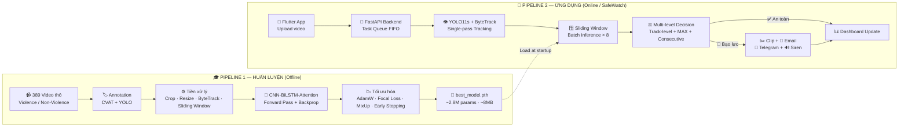

---

## 🎓 Pipeline 1: Huấn luyện Mô hình

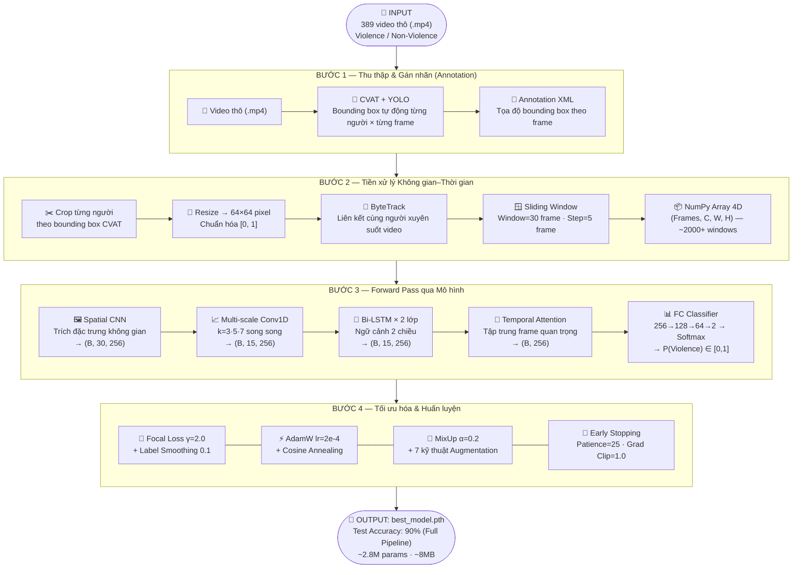

---

## 🧠 Kiến trúc Mô hình AI — CNN-BiLSTM-Attention

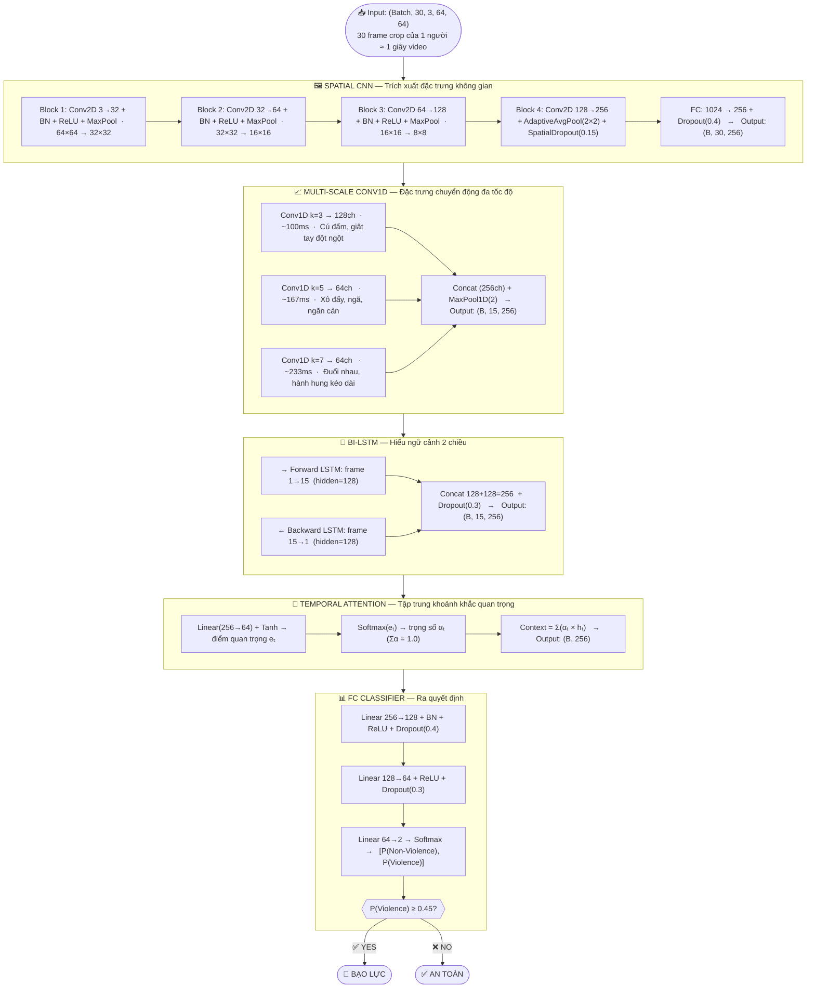

**Thông số mô hình:**

| Thông số | Giá trị |
|---|---|
| Tổng tham số | ~2,800,000 (~2.8M) — 100% trainable |
| Kích thước file | ~8 MB (float32) |
| Input | `(Batch, 30, 3, 64, 64)` |
| Output | `P(Violence) ∈ [0, 1]` |
| Ngưỡng quyết định | ≥ 45% → Bạo lực |

---

## 🚀 Pipeline 2: Ứng dụng thực tế — SafeWatch Inference

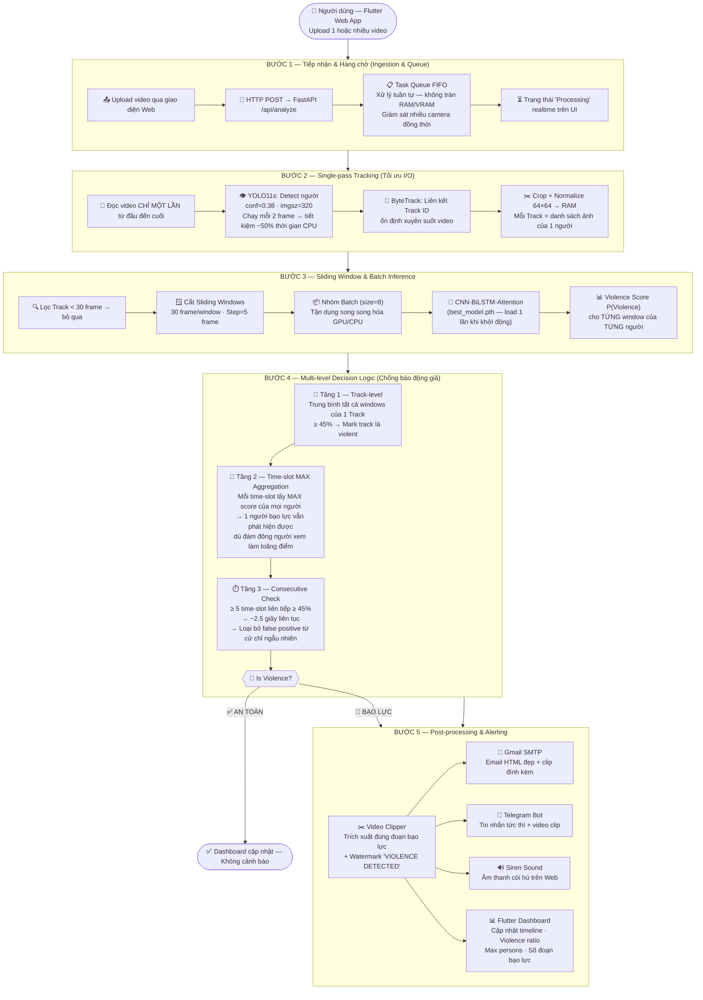

### Tại sao dùng MAX thay vì MEAN?

> **Ví dụ thực tế**: 2 người đánh nhau `P=0.85` + 15 người đứng xem `P=0.08`
> - **MEAN** = `(2×0.85 + 15×0.08) / 17` = **0.17** → ❌ **Bỏ sót!**
> - **MAX** = `0.85` → ✅ **Phát hiện đúng!**

---

## 🏗️ Kiến trúc Hệ thống

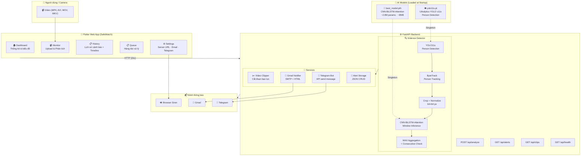

---

## 📱 Giao diện Ứng dụng — SafeWatch

### Monitor — Upload & Phân tích

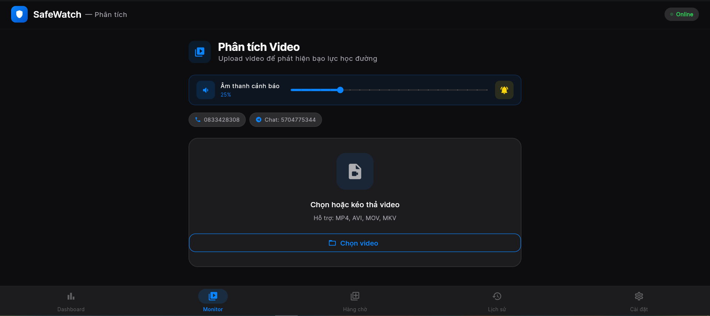

### Hàng chờ — Xử lý đa video (Multi-camera)

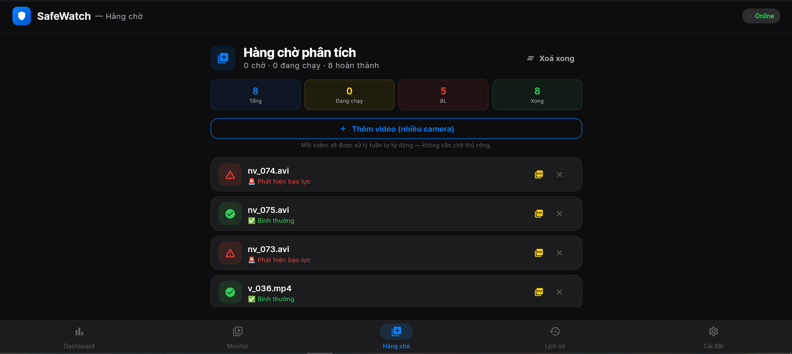

### Dashboard — Thống kê tổng quan

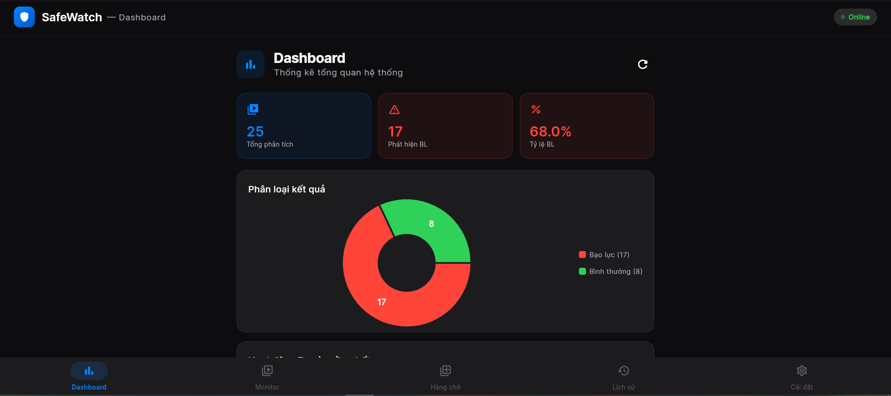

### Lịch sử — Violence Timeline

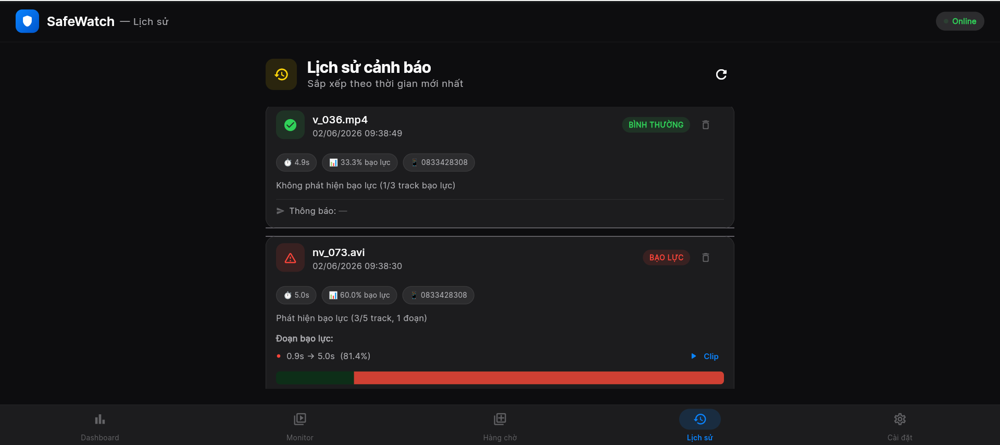

### Cài đặt — Cấu hình Email / Telegram / Server

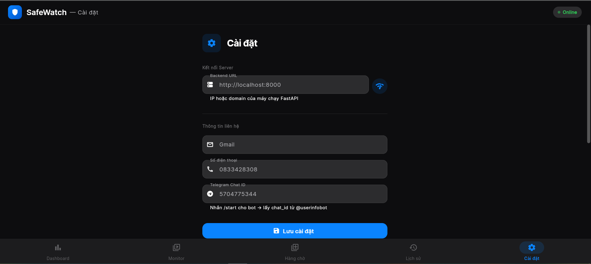

---

## 📊 Kết quả Thực nghiệm

### So sánh 3 phương pháp đánh giá (40 video test)

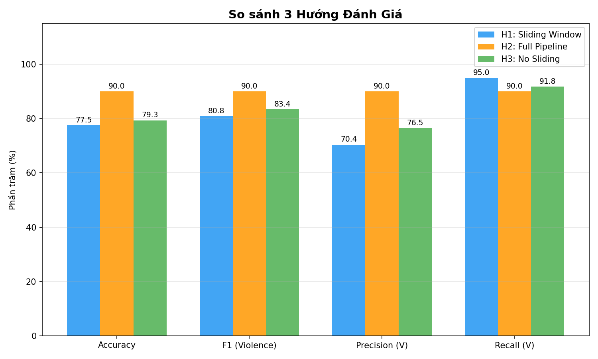

| Phương pháp | Accuracy | F1 (Violence) | Precision | Recall |
|---|---|---|---|---|
| **H1: Sliding Window** | 77.5% | 80.8% | 70.4% | **95.0%** |
| **H2: Full App Pipeline** ⭐ | **90.0%** | **90.0%** | **90.0%** | 90.0% |
| **H3: No Sliding** | 79.3% | 83.4% | 76.5% | 91.8% |

> **H2 — Full App Pipeline** đạt hiệu suất tốt nhất **90% Accuracy** trên tập test 40 video. Đây là cách hệ thống thực sự hoạt động trong ứng dụng SafeWatch.

### Confusion Matrix — Test Set (Window-level)

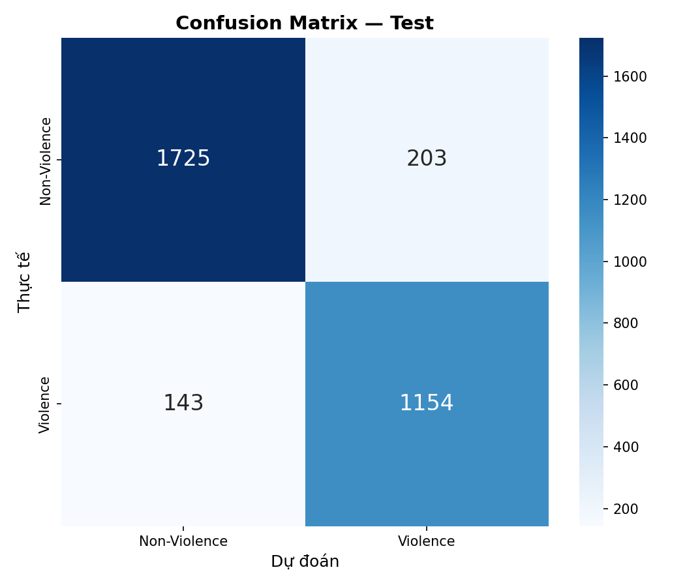

| Metric | Giá trị |
|---|---|
| True Positive (Violence đúng) | **1,154** |
| True Negative (Non-Violence đúng) | **1,725** |
| False Positive | 203 |
| False Negative | 143 |
| **Accuracy tổng** | **~89%** |

### Quá trình Huấn luyện — Loss & Accuracy

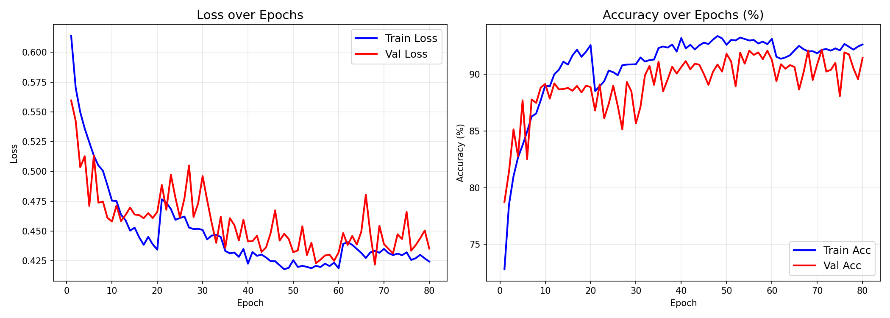

- **Train Accuracy**: ~91% sau ~80 epochs
- **Val Accuracy**: ~90% — không có dấu hiệu overfitting nghiêm trọng
- **Hội tụ**: Loss giảm ổn định từ 0.61 → 0.42

### Phân phối Xác suất — Test Set

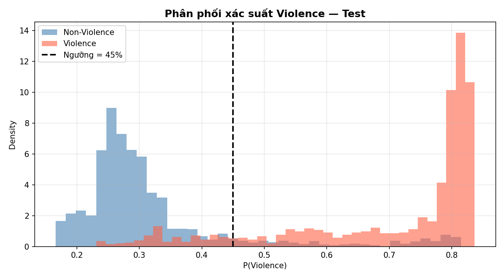

Biểu đồ cho thấy mô hình **phân biệt rõ ràng** hai lớp:
- **Non-Violence** (xanh): tập trung ở vùng P < 0.35
- **Violence** (cam): tập trung ở vùng P > 0.70
- **Ngưỡng 45%** (đường đứt nét) tạo vùng phân tách hiệu quả

### Phân phối Dữ liệu Huấn luyện

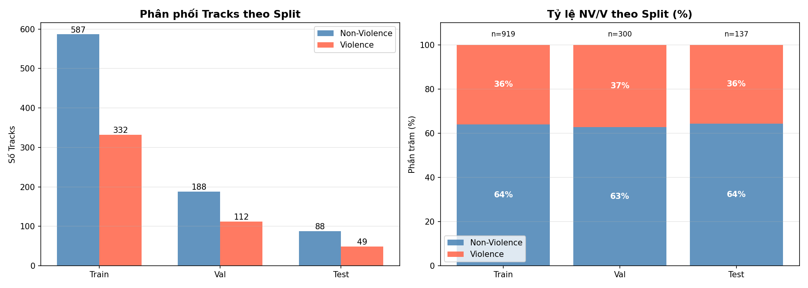

- **Tổng Tracks**: ~1,356 (Train: 919, Val: 300, Test: 137)
- **Tỉ lệ Violence**: ~36% trên mọi tập — phân phối đều, không bị lệch

---

## 📦 Dataset

### Tải xuống

> 📥 **Download dataset tại [GitHub Releases](https://github.com/MinhkhoaDS22/dectect_violence_in_school/releases)**

Dataset bao gồm file `data_labels.zip` chứa toàn bộ video gốc và annotation labels.

### Thông tin dataset

| Thông tin | Chi tiết |
|---|---|
| **Tổng số video** | 300 video |
| **Phân loại** | Violence (bạo lực) + Non-Violence (không bạo lực) |
| **Nguồn** | Thu thập từ môi trường trường học |
| **Annotation** | Bounding box theo frame cho từng người (CVAT format — XML) |
| **FPS gốc** | Đa dạng, được chuẩn hoá về 30 FPS khi tiền xử lý |

### Cấu trúc bên trong `data_labels.zip`

```
data_labels.zip
├── data/
│   ├── violence/              # Video có hành vi bạo lực
│   └── non_violence/          # Video không có bạo lực
└── fix_labels/                # Annotation XML (CVAT format)
    ├── violence/
    └── non_violence/
```

### Chia dữ liệu

| Tập | Tỷ lệ | Video | Tracks (ước tính) |
|---|---|---|---|
| **Train** | 70% | ~210 | ~919 |
| **Validation** | 20% | ~60 | ~300 |
| **Test** | 10% | ~30 | ~137 |

> ⚠️ Chia theo **video** (không theo track) để tránh data leakage.

---

## ⚡ Backend API

| Method | Endpoint | Mô tả |
|---|---|---|
| `GET` | `/api/health` | Kiểm tra trạng thái server |
| `POST` | `/api/analyze` | Upload video + phân tích bạo lực |
| `GET` | `/api/alerts` | Lấy danh sách cảnh báo |
| `GET` | `/api/alerts/{id}` | Xem chi tiết 1 cảnh báo |
| `DELETE` | `/api/alerts/{id}` | Xoá cảnh báo |
| `GET` | `/api/clips/{job_id}/{filename}` | Download clip bạo lực |

**Response mẫu từ `/api/analyze`:**
```json
{
  "is_violence": true,
  "segments": [
    { "start_sec": 2.5, "end_sec": 8.1, "confidence": 85.4 }
  ],
  "video_duration": 12.3,
  "violence_ratio": 0.62,
  "max_violent_persons": 3,
  "summary": "Phát hiện bạo lực (1 đoạn, 38/61 time-slot vượt ngưỡng, tối đa 3 người bạo lực cùng lúc)"
}
```

---

## 🚀 Cài đặt và chạy

### Yêu cầu

- Python 3.10+
- Flutter 3.10+ (SDK ^3.10.1)
- CUDA (khuyến nghị, để chạy GPU)

### 1. Huấn luyện mô hình

```bash
pip install torch torchvision opencv-python numpy matplotlib seaborn scikit-learn tqdm ultralytics

# Chuẩn bị dữ liệu
# - data/violence/ và data/non_violence/
# - fix_labels/violence/ và fix_labels/non_violence/

python train_ai.py
# → Output: results/best_model.pth
```

### 2. Chạy Backend

```bash
cd backend
pip install -r requirements.txt
pip install torch torchvision ultralytics

cp .env.example .env
# Điền Gmail App Password, Telegram Bot Token, đường dẫn model

uvicorn main:app --reload --host 0.0.0.0 --port 8000
```

**Cấu hình `.env`:**
```env
GMAIL_SENDER=your_email@gmail.com
GMAIL_APP_PASSWORD=xxxx xxxx xxxx xxxx
TELEGRAM_BOT_TOKEN=your_bot_token_here
MODEL_PATH=../results/best_model.pth
YOLO_PATH=../yolo11s.pt
```

### 3. Chạy Flutter App

```bash
cd violence_app
flutter pub get
flutter run -d chrome
```

> Vào **Settings** để cấu hình Server URL → `http://localhost:8000`

---

## 📁 Cấu trúc thư mục

```
DATN/
├── train_ai.py              # Script huấn luyện CNN-BiLSTM-Attention
├── evaluate_model.py        # Đánh giá hiệu suất (3 hướng)
├── dectect_people.py        # Script detect người (testing)
├── report_DATN.pdf          # Báo cáo đồ án tốt nghiệp
│
├── data/                    # Video gốc
│   ├── violence/
│   └── non_violence/
├── fix_labels/              # Annotation XML (CVAT)
├── processed_tracks_v5/     # Cache tiền xử lý (.npy)
│
├── results/                 # Kết quả huấn luyện & ảnh app
│   ├── best_model.pth       # Model tốt nhất (~8MB)
│   ├── improved_history.png # Loss & Accuracy curves
│   ├── confusion_matrix_*.png
│   ├── prob_dist_*.png
│   ├── data_distribution.png
│   └── *.png                # Screenshots app SafeWatch
│
├── test_result/             # Kết quả đánh giá chi tiết
│   ├── comparison_summary.png
│   ├── evaluation_report.txt
│   └── approach*_*.png
│
├── backend/                 # FastAPI Backend
│   ├── main.py              # API endpoints
│   ├── violence_detector.py # Detection pipeline
│   ├── video_clipper.py     # Cắt clip bạo lực
│   ├── notifier.py          # Gmail + Telegram
│   └── requirements.txt
│
├── violence_app/            # Flutter App (SafeWatch)
│   └── lib/
│       ├── screens/         # 7 màn hình UI
│       ├── services/        # API, PDF, Queue, Sound
│       ├── models/          # AlertModel, QueueJob
│       └── widgets/         # Timeline, SoundBar
│
├── yolo11s.pt               # YOLO v11s weights
└── pipeline.txt             # Mô tả pipeline (text)
```

---

## 🛠️ Công nghệ sử dụng

### AI / Deep Learning

| Công nghệ | Phiên bản | Mục đích |
|---|---|---|
| PyTorch | - | Framework deep learning chính |
| Ultralytics YOLO | v11s | Person detection + ByteTrack |
| OpenCV | 4.9.0 | Xử lý video, crop, resize |
| scikit-learn | - | Metrics, confusion matrix |
| NumPy | 1.26.4 | Xử lý dữ liệu số |

### Backend

| Công nghệ | Phiên bản | Mục đích |
|---|---|---|
| FastAPI | 0.111.0 | REST API framework |
| Uvicorn | 0.30.0 | ASGI server |
| python-dotenv | 1.0.1 | Quản lý biến môi trường |
| smtplib | built-in | Gửi email Gmail |
| python-telegram-bot | 21.3 | Cảnh báo Telegram |

### Frontend

| Công nghệ | Phiên bản | Mục đích |
|---|---|---|
| Flutter | SDK ^3.10.1 | Framework UI cross-platform |
| Dio | 5.4.3 | HTTP client |
| fl_chart | 1.2.0 | Biểu đồ thống kê |
| flutter_animate | 4.5.0 | Micro-animations |
| pdf + printing | - | Xuất báo cáo PDF |

---

## 👨‍💻 Tác giả - Trương Minh Khoa

Đồ án tốt nghiệp — Trường Đại học Công nghệ TP.HCM (HUTECH) 2026

---

*SafeWatch — Phát hiện bạo lực, bảo vệ học đường* 🛡️
